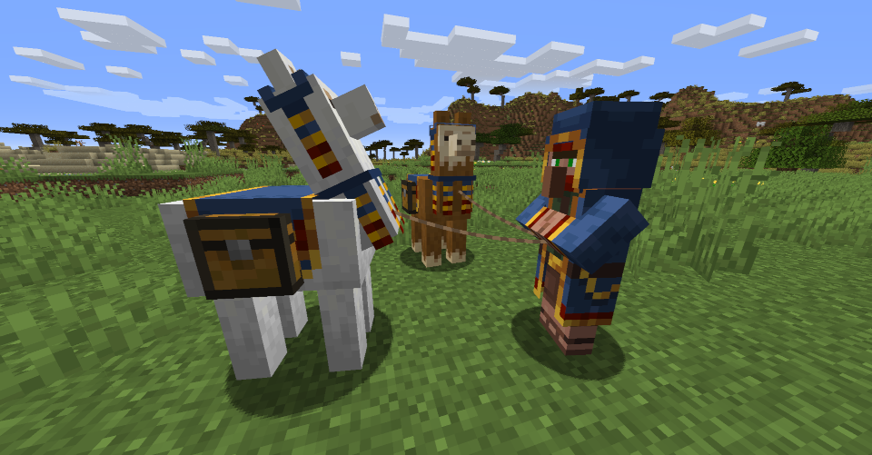
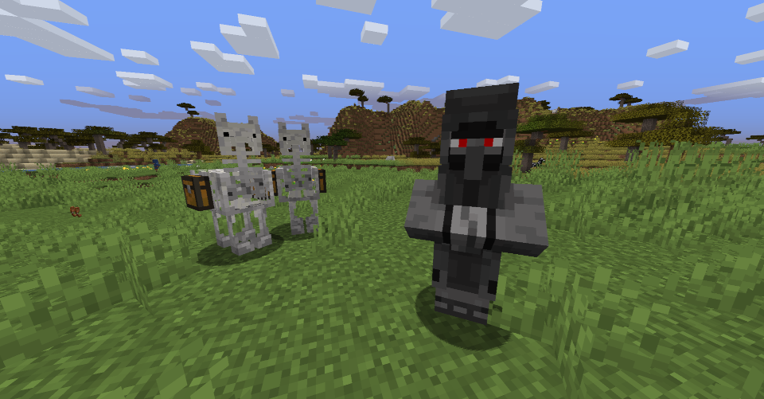

<h1 align="center">The Evil Wandering Trader   
	
	
	
</h1>

A small and funny minecraft mod.

### Information

- You can download the mod on its official curseforge page : <https://www.curseforge.com/minecraft/mc-mods/evil-wandering-trader>
- Install instructions for Eclipse or IntelliG are located in the file named [README.txt](README.txt)

***

### Description

This minecraft mod adds a wandering trader that can become angry, targeting you, if you fail him (checking his sells but without making a deal) or if you hurt him.

If he becomes angry, he will hit you, stealing your items and his llamas will transform in their skeletal version, running away with your stolen items, stored in their chest.

Some people say he would eventually calm down, but only few have been smart enough to escape from his surveillance (or simply to survive the meeting).

***

### Versions

- Version 1.0 (tested on `Forge 1.16.5-36.0.43`) - base mod tested (*2021 May 21th*)
- Version 1.1 (tested on `Forge 1.16.5-36.0.43`) - spawn fixes (*2021 May 28th*)
- Version 1.2 (tested on `Forge 1.16.5-36.0.43`) - small bug fixes (*2021 June 7th*)

***

### Context

This work has been realized as an open group project, featuring 4 bachelor students of [Télécom SudParis](https://www.telecom-sudparis.eu/) - France in 2021.

- Lead developer: [Victor Laforet](https://github.com/vlaforet)
- Co-developer: [Dichiara](https://github.com/Dichiara25)
- Moral support: François B.
- Co-developer/Maintainer: [Paralogos](https://github.com/Paralogoss)
